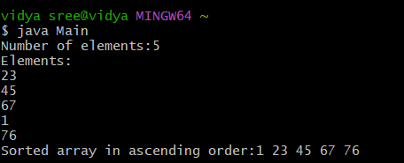

# java-lab-cse-g-5ef-3c
experiment-3c
## EXPERIMENT -3C 
# using bubble sort to sort the set of elements using bubble sort 
source code  
java 
```
(logic file)
import java.util.Arrays;

class Sortlogic {
    void bubblesort(int[] a) {
        int n = a.length;
        for (int i = 0; i < n - 1; i++)
            for (int j = 0; j < n - i - 1; j++)
                if (a[j] > a[j + 1]) {
                    int t = a[j]; a[j] = a[j + 1]; a[j + 1] = t;
                }


        System.out.println(Arrays.toString(a).replaceAll("[\\[\\],]", ""));
    }
}
(main file)
import java.util.Scanner;
public class Main {
    public static void main(String[] args) {
        Scanner S= new Scanner(System.in);
System.out.print("Number of elements:");
int[]arr = new int  [S.nextInt()];
System.out.println("Elements:");
for(int i=0 ; i<arr.length; i++)arr[i]=S.nextInt();
System.out.print("Sorted array in ascending order:");
new Sortlogic().bubblesort(arr);

    }
}


```
# OUTPUT: 

